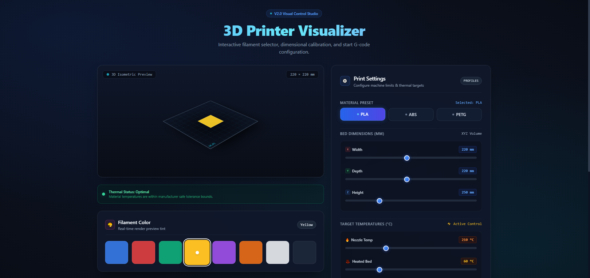
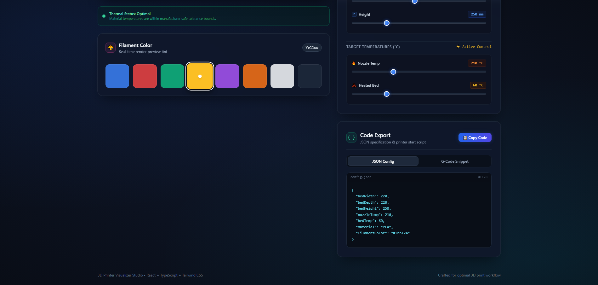

# 🖨️ 3D Printer Visualizer

<div align="center">

  <p>An interactive 3D printer configuration dashboard for simulating build volume, thermal states, and generating profile specifications in real time.</p>

  [](https://3d-printer-visualizer.vercel.app/)
  [](LICENSE)
  [](https://react.dev/)
  [](https://www.typescriptlang.org/)
  [](https://tailwindcss.com/)
  [](https://vitejs.dev/)

  <a href="https://3d-printer-visualizer.vercel.app/"><strong>Explore the Live Demo »</strong></a>

</div>

<p align="center">
  
  
</p>

---

## 📌 Overview

**3D Printer Visualizer** is a modern frontend tool designed to provide real-time visual feedback for 3D printer parameters. It calculates and renders isometric build dimensions, simulates thermal controls for the nozzle and heated bed, and generates structured JSON specifications ready for slicer configurations.

---

## ✨ Features

- **Isometric Build Volume Visualization:** Real-time visual feedback reflecting dynamic dimensional changes across X, Y, and Z axes.
- **Dynamic Dimension Controls:**
  - 📏 **Width (X-Axis):** Dynamic horizontal bed adjustment.
  - ↔️ **Depth (Y-Axis):** Dynamic depth adjustment.
  - ↕️ **Height (Z-Axis):** Vertical printable height adjustment.
- **Thermal Simulation & Monitoring:**
  - 🔥 **Extruder / Nozzle Temperature:** Interactive target adjustments with range validation.
  - 🌡️ **Heated Bed Temperature:** Real-time thermal status monitoring.
- **Material Presets & Customization:**
  - Standard material presets (PLA, etc.) with pre-configured thermal profiles.
  - Custom filament color picker updating the preview surface dynamically.
- **Configuration & Script Export:**
  - Instant JSON profile generation based on active parameters.
  - Preview of custom printer start G-code / setup scripts.
- **Modern & Responsive UI:** Dark-mode dashboard built with Tailwind CSS, optimized for both desktop and mobile viewports.
- **Type-Safe Architecture:** Strict TypeScript interfaces ensuring robust component state and configuration handling.

---

## 🚀 Tech Stack

- **Frontend Core:** [React 18](https://react.dev/)
- **Build Tool:** [Vite](https://vitejs.dev/)
- **Language:** [TypeScript](https://www.typescriptlang.org/)
- **Styling:** [Tailwind CSS](https://tailwindcss.com/)
- **Icons:** [Lucide React](https://lucide.dev/)
- **Deployment:** [Vercel](https://vercel.com/)

---

## 🖥️ How It Works

1. **Define Dimensions:** Enter the custom build volume (Width, Depth, Height) to adjust the isometric boundary.
2. **Select Material:** Choose from available presets or set custom thermal ranges for nozzle and bed.
3. **Customize Aesthetics:** Select a filament color to customize the 3D model viewport.
4. **Export Configuration:** Copy or download the generated JSON printer profile and initialization script.

---

## 🛠️ Getting Started

Follow these steps to run the project locally:

### Prerequisites

- **Node.js:** `v18.0.0` or higher
- **Package Manager:** `npm`, `yarn`, or `pnpm`

### Installation & Run

1. **Clone the repository:**
```bash
   git clone https://github.com/fmadihi/3d-printer-visualizer.git
   cd 3d-printer-visualizer
npm install
npm run dev
```

---

## 📂 Project Structure
```text
3d-printer-visualizer/
├── public/                 # Static assets
├── src/
│   ├── assets/             # SVGs and static media
│   ├── components/         # Modular React components (Controls, Visualizer, Header)
│   ├── types/              # TypeScript types and interfaces
│   ├── App.tsx             # Main dashboard layout & global state
│   ├── main.tsx            # Application entry point
│   └── index.css           # Tailwind base styles
├── package.json
├── tailwind.config.js
├── tsconfig.json
└── vite.config.ts

```

### 👩‍💻 Author
**Fatemeh Madihi** — Frontend Developer

- **Website:** [fatemehmadihi.ir](https://www.fatemehmadihi.ir)
- **GitHub:** [@fmadihi](https://github.com/fmadihi)
- **LinkedIn:** [Fatemeh Madihi](https://www.linkedin.com/in/fatemeh-madihi/)

---

<div align="center">
  Built with clean code principles using React & TypeScript.
</div>
